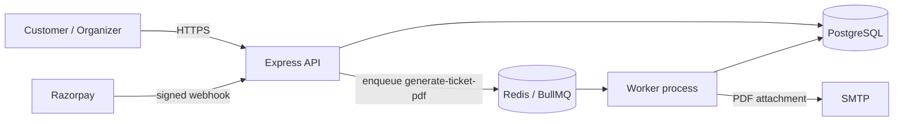

# Ticketing Platform API

A multi-tenant event ticketing backend. Organizations sell tickets to their events, customers pay through Razorpay, and each ticket gets an HMAC-signed QR code that can be scanned exactly once at the door. Ticket PDFs are generated and emailed in the background, so payment confirmation never waits on rendering or email.

**Stack:** Node.js 20+, Express 5, PostgreSQL + Prisma, Redis + BullMQ, Razorpay, pdfkit, Nodemailer, Zod, Jest.

## Architecture



**How a purchase flows**
1. `POST /api/organization/:orgId/events/:eventId/orders` reserves seats in one transaction. The update is conditional, so the event can never oversell, and an idempotency key makes retries safe.
2. `POST /api/orders/:id/checkout` creates the Razorpay order, which the client opens in Checkout.js.
3. Razorpay's `payment.captured` webhook (HMAC-verified and processed at most once) and/or `verify-payment` mark the order `PAID` and issue one signed QR ticket per seat.
4. After the transaction commits, a `generate-ticket-pdf` job is queued. The worker renders the PDF (one page and one QR code per ticket), saves it, and emails it. A failed email is retried with exponential backoff, and `ticketsEmailedAt` makes sure the customer is emailed at most once.
5. At the door, `POST …/checkin` verifies the QR signature and marks the ticket `used` with a single conditional update, so a second scan is rejected.

**Things that are deliberately robust**
- *Seat counts:* a reservation is a conditional SQL update inside a transaction, and pending orders expire and release their seats (a sweep runs every 60s).
- *Payments and refunds:* webhooks are deduplicated by event ID, and refunds reserve the amount atomically so concurrent refunds can't exceed what was paid.
- *Background jobs:* adding a job never blocks or fails a payment. If Redis is down, a sweep every 5 minutes re-queues paid orders that haven't been emailed. The job ID is the order ID, so an order can't be queued twice.
- *Payouts:* the balance only counts events that have ended, net of refunds, including refunds still in flight. A payout request locks the organization row, so two concurrent requests can't claim the same money.

## Running locally

Prerequisites: Node 20+, PostgreSQL, and Docker (for Redis).

```bash
cd backend
cp .env.example .env          # fill in DATABASE_URL, JWT/QR secrets, Razorpay test keys, SMTP
npm install
npm run db:migrate            # apply migrations
npm run seed:dev              # demo org, owner, customer, event and tier
npm run redis:up              # Redis in Docker

npm run dev                   # terminal 1: API on http://localhost:5000
npm run worker:dev            # terminal 2: background worker
```

- Open `http://localhost:5000/dev` for a test checkout page (it's disabled when `NODE_ENV=production`).
- To push a ticket job by hand: `npm run queue:ticket-pdf -- <orderId>`. With no ID, it uses the latest paid order.
- To run the API without Redis, set `JOB_QUEUE_DISABLED=true`.
- For email in development, a sandbox inbox such as [Mailtrap](https://mailtrap.io) works. Put its host, port and credentials in `SMTP_*`.

**Tests:** `npm test` runs against a separate `<db>_test` database, which is created and migrated automatically. They need Postgres, but not Redis or SMTP.

## API overview

Every route except the public, auth and webhook ones needs `Authorization: Bearer <accessToken>`. Org routes check the caller's role in that organization (`viewer < editor < admin < owner`). `/api/admin` requires the platform-wide `platformAdmin` role.

| Area | Endpoints |
|---|---|
| Auth | `POST /api/auth/register`, `login`, `refresh`, `logout`, `verify-email`, `resend-verification`, `forgot-password`, `reset-password/:token` |
| Me | `GET /api/users/me`, `PATCH /api/users/profile`, `POST /api/users/change-password` |
| Public events | `GET /api/events` (paginated: `page`, `limit`, `from`, `to`, `search`), `GET /api/events/:id`, `GET /api/events/:id/tiers` |
| Organization | `GET/PATCH /api/organization/:orgId`, `GET …/members`, `POST …/invite`, `PATCH …/members/:id/role`, `DELETE …/members/:id` |
| Events & tiers | `GET/POST /api/organization/:orgId/events`, `GET/PATCH/DELETE …/events/:eventId`, `GET/POST …/:eventId/tiers`, `PATCH/DELETE …/tiers/:tierId` |
| Orders (customer) | `POST …/events/:eventId/orders`, `GET /api/orders`, `GET /api/orders/:id`, `POST /api/orders/:id/checkout`, `POST /api/orders/:id/verify-payment`, `GET /api/orders/:id/tickets/pdf` |
| Tickets | `GET /api/tickets`, `GET /api/tickets/:id`, `POST …/events/:eventId/checkin`, `GET …/events/:eventId/tickets` |
| Orders (organizer) | `GET /api/organization/:orgId/orders`, `GET …/orders/:id`, `POST …/orders/:id/refund` |
| Analytics | `GET …/events/:eventId/analytics?from=&to=` (revenue, per-tier sales, daily sales, attendance, views/conversion), `GET /api/organization/:orgId/analytics` |
| Payouts | `PUT …/:orgId/payout-details` (owner), `GET …/:orgId/payouts` (balance + history), `POST …/:orgId/payouts` (owner; needs a verified org) |
| Platform admin | `GET /api/admin/organizations`, `PATCH /api/admin/organizations/:id/verification`, `GET /api/admin/users`, `GET /api/admin/payouts`, `PATCH /api/admin/payouts/:id` (`PAID` + bank reference, or `CANCELLED`) |
| Webhooks | `POST /api/payments/webhook/razorpay` |
| Ops | `GET /health` (checks the DB; used by the host's health check) |

Money is always an integer in minor units (paise), e.g. `amountMinor: 49900` is ₹499.00.

## Deploying (Render)

`render.yaml` describes the whole stack: the API (web service), the worker (background worker), Postgres, and Redis (Key Value, set to `noeviction` as BullMQ requires).

1. Push the repo to GitHub.
2. In Render, choose **New → Blueprint** and select the repo.
3. Fill in the secrets it asks for: Razorpay keys, SMTP, `PAYOUT_ENCRYPTION_KEY`, `FRONTEND_URL` and `CORS_ORIGIN`. JWT and QR secrets are generated for you.
4. The API runs `prisma migrate deploy` before it starts, and Render polls `/health`.
5. In the Razorpay dashboard, point a webhook at `https://<api-host>/api/payments/webhook/razorpay` for `payment.captured`, `payment.failed`, `refund.processed` and `refund.failed`.

Notes:
- The free web service sleeps when idle, and Render's free Postgres expires after 30 days. Background workers need a paid plan.
- Ticket PDFs are stored on local disk, which is ephemeral on Render. The download endpoint re-renders a missing PDF, so nothing is lost. For durable files, switch `ticketDelivery.service.js` to object storage (S3/R2).
- Secrets only ever live in the host's environment. `.env` is gitignored.
